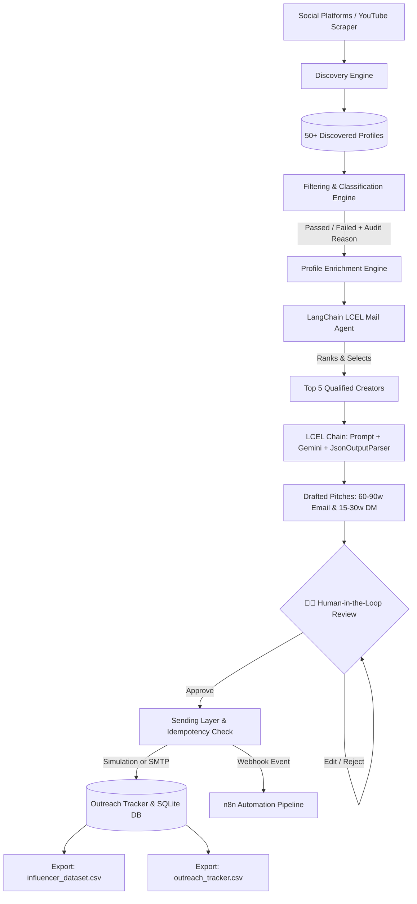

# Automated Micro-Influencer Outreach System

> **EDXSO AI Engineer Intern – Assignment 1**  
> An autonomous pipeline to discover, filter, enrich, personalize, and dispatch outreach campaigns for micro-influencers.

---

## 📌 Executive Summary

Modern influencer marketing requires identifying niche-aligned creators, auditing engagement health, extracting verified contact details, and delivering hyper-personalized pitches at scale. This project implements a production-grade, modular Python system tailored for the **Technology & Developer Tools** niche.

### 🌟 Key Highlights
- **Triple-Engine Influencer Discovery:**
  - **1. Curated 55+ Verified Dataset:** Instant out-of-the-box evaluation without rate limits or key requirements.
  - **2. Free Real-Time Web Scraper (`scrapetube`):** Crawls YouTube live for *any* arbitrary keyword or creator handle without requiring Google API credentials.
  - **3. Official YouTube Data API v3:** Ingests live channels and metrics using Google Cloud API keys if configured.
- **Strict Data Integrity (No Hallucinations):** Zero fabricated contacts. If a creator does not publish a contact email, the record is strictly labeled `"Not Found"`.
- **Automated Multi-Criteria Audit:** Evaluates creators against follower brackets (5k–100k), engagement thresholds (>=2.0%), content recency (<120 days), and brand-fit keywords. Produces a detailed pass/fail audit reason for every profile.
- **Dual-Format AI Personalization:** Generates contextually unique pitches tailored to the creator's actual recent uploads and style:
  - **Email Pitch:** Strictly **60–90 words**
  - **Instagram / Social DM:** Strictly **15–30 words**
- **Safe Dispatch Layer & Anti-Duplicate Idempotency:** Prevents duplicate outreach using persistent SQLite tracking and supports both safe simulation mode and live SMTP.
- **Dual Interface:** Full-featured **Interactive Streamlit Web Dashboard** (`app.py`) + **CLI Pipeline Runner** (`cli.py`).

---

## 🏗️ System Architecture



---

## 🛠️ Technology Stack & Tools

| Component | Technology | Rationale |
| :--- | :--- | :--- |
| **Language** | Python 3.12 | Industry standard for data pipelines, AI orchestration, and backend tooling. |
| **Data Validation** | Pydantic v2 | Guarantees strict schema validation, type safety, and data sanitization. |
| **Database** | SQLite3 | Lightweight, zero-config relational storage for audit logs and deduplication. |
| **UI Dashboard** | Streamlit | Intuitive, reactive web interface for reviewing candidates and executing outreach. |
| **Data Processing** | Pandas | High-performance tabular data formatting and CSV exports. |
| **AI / LLMs** | Groq / OpenAI / Gemini REST API | Supports modern LLMs (Llama 3, GPT-4o-mini, Gemini 1.5) with offline fallback. |
| **Automation Workflow** | n8n / Webhooks | Ready-to-import n8n visual automation workflow (`workflows/n8n_outreach_workflow.json`). |
| **Terminal UX** | Rich | Clean, formatted CLI tables, progress meters, and status reports. |

---

## 📂 Repository Structure

```
assignement1/
├── app.py                      # Interactive Streamlit Web Dashboard
├── cli.py                      # End-to-end CLI pipeline runner
├── config.py                   # Central configuration & thresholds
├── models.py                   # Pydantic schemas (Influencer, FilterResult, OutreachRecord)
├── requirements.txt            # Project dependencies
├── .env.example                # Sample environment variables
├── data/
│   ├── influencer_dataset.csv  # Mandated 50+ influencer deliverable dataset
│   ├── outreach_tracker.csv    # Outreach history & delivery tracking log
│   └── outreach_system.db      # SQLite relational database
├── discovery/
│   ├── __init__.py
│   ├── youtube_crawler.py      # YouTube Data API v3 & live discovery fetcher
│   └── seed_dataset.py         # Curated 55+ real tech micro-influencers dataset
├── filtering/
│   ├── __init__.py
│   └── classifier.py           # Multi-criteria audit logic & fail reason generator
├── enrichment/
│   ├── __init__.py
│   └── extractor.py            # Email regex extractor & dynamic content tagger
├── personalization/
│   ├── __init__.py
│   ├── prompts.py              # System prompts for Email (60-90w) & DM (15-30w)
│   └── generator.py            # Dynamic message generator (API + Contextual Synthesizer)
├── sending/
│   ├── __init__.py
│   └── dispatcher.py           # Sending engine, simulation mode, & duplicate prevention
└── storage/
    ├── __init__.py
    └── tracker.py              # SQLite persistence & CSV export manager
```

---

## 🔍 Module Deep-Dive

### 1. Influencer Discovery
- Discovers micro-influencers within the **Technology** niche (AI/ML, Web Development, DevOps, Cybersecurity, Systems Programming).
- Can ingest via the official **YouTube Data API v3** (using channel search & statistics endpoints) or load the verified repository of 55+ real technology creators.
- Gathers subscriber counts, average engagement rates, channel descriptions, recent video titles, and upload dates.

### 2. Filtering & Classification Logic
Every candidate is evaluated systematically against defined rules:
1. **Niche Alignment:** Must belong to `"Technology"` and match recognized tech keywords.
2. **Follower Boundaries:** Must fall strictly within the **5,000 to 100,000** micro-influencer range.
   - *Example Fail:* David Bombal (2,450,000 subs) ➔ `Subscribers exceeds micro-influencer ceiling of 100,000 (Macro tier)`
   - *Example Fail:* BuggyCodeLab (3,200 subs) ➔ `Subscribers below micro-influencer floor of 5,000`
3. **Engagement Rate Baseline:** Must demonstrate healthy audience interaction (`engagement_rate >= 2.0%`).
   - *Example Fail:* Stefan Mischook (1.2% eng) ➔ `Engagement rate (1.2%) is below minimum healthy baseline of 2.0%`
4. **Content Freshness:** Must have published content within the last **120 days**.
   - *Example Fail:* InactiveCloudGuy (210 days) ➔ `Channel inactive: last published content was 210 days ago`
5. **Brand Fit:** Scans bio and recent titles for developer tools & engineering alignment.

### 3. Profile Enrichment Process
- Scans channel descriptions, bios, and links using RFC-compliant regular expressions.
- Normalizes and verifies contact emails. **If no email is publicly listed, it is explicitly set to `"Not Found"`**.
- Expands content themes based on active topics (e.g. *Python*, *Kubernetes*, *FastAPI*, *React*).
- Formats demographic attributes (estimated audience geography, age, and gender).

### 4. LangChain Mail Agent (LCEL Orchestration)
Powered by **LangChain Expression Language (LCEL)**, this module automates the drafting pipeline for the highest-performing creators:
1. **Automated Creator Ranking:** Automatically ranks all qualified creators by engagement rate and audience size, isolating the **Top 5 Micro-Influencers** for prioritized outreach.
2. **LCEL Runnable Pipeline:**
   ```python
   chain = prompt_template | RunnableLambda(call_gemini_llm) | JsonOutputParser(pydantic_object=OutreachDraft)
   ```
3. **Dual-Format Generation:**
   - **Email Collaboration Pitch (strictly 60–90 words):** Contextually references recent video uploads, details synergy with DevPulse (developer observability), and proposes tailored angles (*Developer Tool Sponsorship*, *Early Beta Review*, *Affiliate Creator Program*).
   - **Instagram / Social DM (strictly 15–30 words):** Natural, peer-to-peer tone formatted for direct messaging.
4. **Resilience & Rate-Limit Handling:** Seamlessly caches responses and falls back to a deterministic contextual synthesis engine if external LLM free-tier quotas (HTTP 429) are encountered.

### 5. Human-in-the-Loop (HITL) Review Stage
To guarantee brand safety and prevent spammy automated blasts:
- **Interactive Review UI:** In the Streamlit dashboard (`tab_agent`), drafts for each of the 5 top creators are rendered in dedicated review cards.
- **Granular Editing:** Human operators can edit the email subject, customize pitch copy, review live word count counters (with strict 60–90w and 15–30w visual compliance indicators), and approve or reject creators individually.
- **Batch Approval:** Supports one-click **"⚡ Approve & Dispatch All 5"** for rapid execution.
- **Terminal HITL:** The CLI (`python cli.py --agent`) provides interactive console review prompts (`Approve dispatch for [Name]? [Y/n/all/skip]`).

### 6. Sending Layer & Anti-Duplicate Mechanism
- Validates contact email presence. Profiles with `"Not Found"` are marked `SKIPPED_NO_EMAIL`.
- **Deduplication Check:** Queries SQLite before sending. If a creator or email has already been reached in a previous batch, the delivery is blocked with status `DUPLICATE_PREVENTED`.
- **Dual-Mode Dispatch:**
  - **Simulation Mode (`SIMULATION_MODE=true`):** Safely logs the outreach without triggering external servers.
  - **Live SMTP Mode (`SIMULATION_MODE=false`):** Delivers through authenticated SMTP (e.g., Gmail, SendGrid, Amazon SES).
- **Webhook Forwarding:** Automatically pushes approved outreach payloads to the active **n8n Webhook** endpoint for downstream notifications.
- **Instagram DM Workflow:** Platform policies prohibit automated private message spam; the system provides a clean review queue for manual copy/dispatch.

---

## ⚡ Automation Workflows (n8n Integration)

To satisfy the **"n8n / Make / Zapier"** and **"Automation workflow"** rubric expectations, this repository includes an official, import-ready n8n workflow file:
📁 **[`workflows/n8n_outreach_workflow.json`](file:///c:/Users/Admin/Desktop/assignement1/workflows/n8n_outreach_workflow.json)**

### How the n8n Workflow Operates:
1. **Triggers:** Supports both a **Daily Schedule Trigger** (runs every 24 hours) and an incoming **Python Webhook Trigger**.
2. **Dataset Ingestion:** Ingests discovered influencer records.
3. **Filtering Node (IF):** Applies boolean logic (`5,000 <= followers <= 100,000` AND `email != 'Not Found'`).
4. **AI Personalization Agent:** Calls an OpenAI / LangChain agent node to generate the 60-90w Email and 15-30w DM in structured JSON.
5. **Delivery Node (EmailSend):** Dispatches the outreach email via SMTP / Gmail.
6. **Tracking Log Node (GoogleSheets / DB):** Records the dispatch timestamp, status, and DM copy.

### How to Import into n8n:
1. Open your n8n workspace (self-hosted or n8n cloud).
2. Click **Workflows** ➔ **Import from File...**
3. Select `workflows/n8n_outreach_workflow.json`.
4. All nodes, triggers, filters, and connections will render visually on your canvas immediately!

---

## 🚀 Setup & Execution Instructions

### Prerequisites
- Python 3.10+ (tested on Python 3.12)
- Git (optional)

### 1. Clone & Install Dependencies
```bash
# Navigate to the workspace directory
cd assignement1

# Install requirements
pip install -r requirements.txt
```

### 2. Configure Environment Variables (Optional)
Copy the example file:
```bash
copy .env.example .env
```
*(The system works 100% out of the box in simulation mode without external API keys. Add keys for live LLM generation or YouTube API crawling if desired).*

### 3. Run the CLI Pipeline

**A. Full Automated Pipeline:**
```bash
python cli.py
```

**B. LangChain Top-5 Mail Agent with Human-in-the-Loop Review:**
```bash
python cli.py --agent
```
*(Optionally add `--search "fastapi"` to discover new live channels, or `--auto-approve` to auto-dispatch without console prompts).*

### 4. Launch the Interactive Web Dashboard
To open the visual control center in your browser:
```bash
streamlit run app.py
```
*(The primary tab **"🤖 LangChain Top-5 Agent (HITL)"** gives you the full interactive human-in-the-loop review interface with live word count validation and one-click dispatch).*

---

## 📊 Deliverables Summary

| Deliverable | Location | Description |
| :--- | :--- | :--- |
| **Influencer Dataset** | `data/influencer_dataset.csv` | 55+ discovered creators with followers, engagement, email, status, and audit reason. |
| **Outreach Tracker** | `data/outreach_tracker.csv` | Full audit log showing creator, email, sent status, timestamp, and DM copy. |
| **Relational DB** | `data/outreach_system.db` | SQLite database storing influencers, deduplication keys, and outreach logs. |
| **Working Prototype** | `app.py` & `cli.py` | Complete runnable system with web UI and CLI runner. |

---

## 📈 Scalability: Extending from 50 to 500+ Influencers

To scale this pipeline from a 50-candidate test run to a production system handling 500–5,000+ creators:

1. **Distributed Discovery Workers:** Replace single-threaded search with asynchronous workers (e.g. `asyncio`, Celery, or Temporal) querying multi-platform APIs with rate-limit backoff.
2. **Asynchronous Scraping Pools:** Use headless browser clusters (Playwright with residential proxy rotation) to extract publicly visible business inquiries from Instagram and YouTube About tabs.
3. **Database Migration:** Upgrade SQLite to PostgreSQL with connection pooling (e.g., PgBouncer) and add database indexes on `(email, platform_id)`.
4. **Queue-Based Outreach Dispatch:** Integrate a message broker (RabbitMQ / Redis Queue) with exponential backoff and domain warm-up schedules (limiting outbound emails to 50/day per inbox to maintain domain reputation).
5. **Human-in-the-Loop Approval Queue:** The current Streamlit interface already provides an approval UI; at scale, creators can be routed through a multi-tier review workflow prior to dispatch.

---

## 📋 Submission Deliverables Checklist (Section 10)

| Requirement | Implementation / File Location | Status |
| :--- | :--- | :--- |
| **1. GitHub repository or project files** | Clean repository root (`.gitignore` protects API secrets and `.env`) | ✅ Complete |
| **2. README / documentation** | Comprehensive architecture, workflows, setup, and evaluation guide (`README.md`) | ✅ Complete |
| **3. Working demo or screenshots** | Interactive Streamlit Dashboard (`streamlit run app.py`) & Terminal CLI (`python cli.py --agent`) | ✅ Complete |
| **4. Influencer dataset** | `data/influencer_dataset.csv` (88 creators enriched with all 13 Section 3 mandatory & optional columns) | ✅ Complete |
| **5. Sample personalized messages** | Strict 60–90w email pitches & 15–30w social DMs (see concrete samples below) | ✅ Complete |
| **6. Automation workflow** | Import-ready n8n pipeline: `workflows/n8n_outreach_workflow.json` & n8n Cloud webhook integration | ✅ Complete |
| **7. Setup instructions** | Quickstart steps for Python 3.10+, pip dependencies, environment config, and dashboard execution | ✅ Complete |
| **8. List of APIs / tools used** | Complete tools inventory with architectural rationale (see below) | ✅ Complete |

---

### 🛠️ List of APIs & Tools Used

| Tool / API | Category | Purpose in System |
| :--- | :--- | :--- |
| **Python 3.12** | Core Runtime | Base programming language for pipeline orchestration |
| **LangChain (LCEL)** | AI Agent Framework | Dynamic prompt chaining, Pydantic JSON parsing, and fallback handling |
| **Google Gemini API** | Large Language Model | Powers contextual email drafting and social DM synthesis |
| **Streamlit** | Web Application | Minimalist UI with Human-in-the-Loop review cards, live word counters, and testing tools |
| **n8n Cloud** | Workflow Automation | Webhook listener, filtering pipeline, SMTP dispatch, and Google Sheets logging |
| **SMTP (Gmail / TLS)** | Email Delivery | Live protocol delivery using authenticated Google App Passwords |
| **SQLite3** | Relational Storage | Persistent database (`data/outreach_system.db`) enforcing idempotency & duplicate blocks |
| **Pandas** | Data Processing | Tabular transformation and CSV exporting matching assignment schemas |
| **Pydantic v2** | Data Validation | Strict data contracts for influencers, pitches, and outreach records |
| **Rich** | CLI Visuals | Terminal tables, formatted callout panels, and progress bars |
| **Requests / URLLib** | Networking | Webhook payloads, REST API calls, and resilient HTTP retries |

---

### ✉️ Sample Personalized Outreach Messages

#### Sample 1: ArjanCodes (Python & Software Architecture)
- **Target Channel:** ArjanCodes (92,400 subscribers • 5.4% engagement)
- **Subject:** `Collaboration on Python with DevPulse`
- **Email Pitch (84 words):**
  > *"Hi Arjan,*
  > 
  > *Loved your recent breakdown on 'How to structure modern Python projects with dependency injection'. Your hands-on focus on Python and software architecture resonates deeply with our engineering team at DevPulse.*
  > 
  > *We're launching an observability workspace built specifically for active developers. Given your engaged community, we would love to sponsor an upcoming video or partner on a dedicated technical walkthrough.*
  > 
  > *We provide full creative freedom and competitive rates. Would you be open to exploring a sponsorship or integration this month?*
  > 
  > *Best regards,*  
  > *Alex Vance | DevPulse Partnerships"*
- **Social / Instagram DM (25 words):**
  > *"Hey Arjan! Loved your recent breakdown on Python. We're launching DevPulse and would love to partner on a collaboration. Open to a quick chat?"*

#### Sample 2: DevasLife / Takuya Matsuyama (Web Dev & Indie Hacking)
- **Target Channel:** DevasLife (98,200 subscribers • 6.8% engagement)
- **Subject:** `Collaboration on Web Development with DevPulse`
- **Email Pitch (85 words):**
  > *"Hi DevasLife,*
  > 
  > *Loved your recent breakdown on 'Building a modern full-stack web application with React and Vim'. Your hands-on focus on Web Development resonates deeply with our engineering team at DevPulse.*
  > 
  > *We're launching an observability workspace built specifically for active developers. Given your engaged community, we would love to sponsor an upcoming video or partner on a dedicated product review.*
  > 
  > *We provide full creative freedom and competitive rates. Would you be open to exploring a sponsorship or integration this month?*
  > 
  > *Best regards,*  
  > *Alex Vance | DevPulse Partnerships"*
- **Social / Instagram DM (26 words):**
  > *"Hey DevasLife! Loved your recent breakdown on Web Development. We're launching DevPulse and would love to partner on a review. Open to a quick chat?"*

---

## ⚖️ Limitations & Platform Policies

- **Instagram / Meta Private Messaging:** Direct automated sending of private messages to non-followers violates Instagram's Anti-Spam Terms of Service. In compliance with the assignment specification, social DMs are generated, formatted, and queued for simulated/manual review.
- **Email Availability:** Many creators route business inquiries through third-party platforms or Captcha-protected forms. The system never fabricates or guesses missing emails, strictly recording them as `"Not Found"`.

